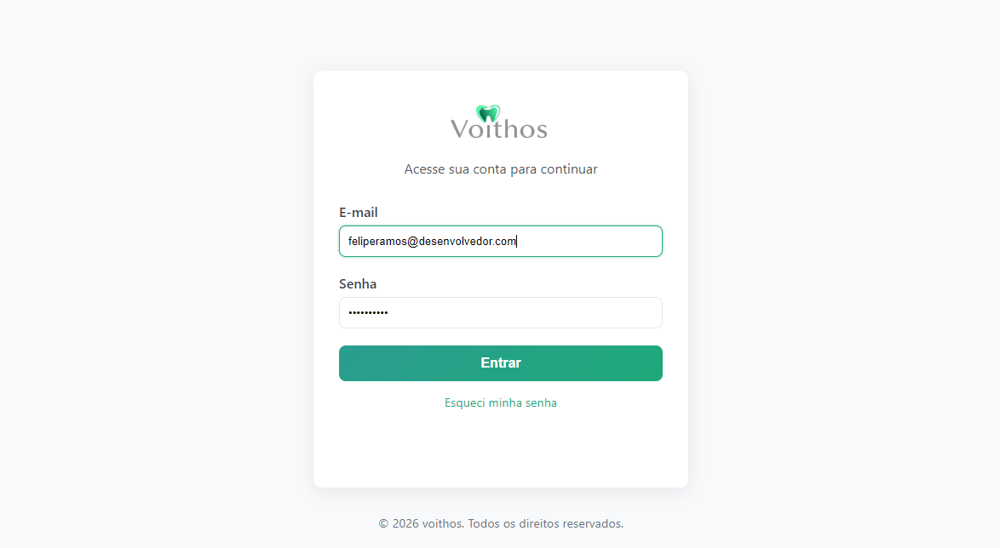
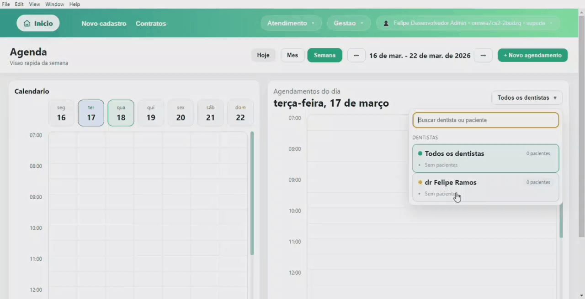
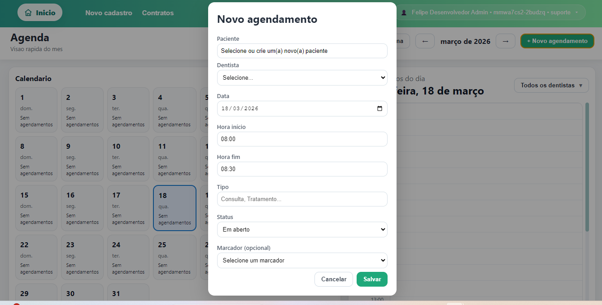
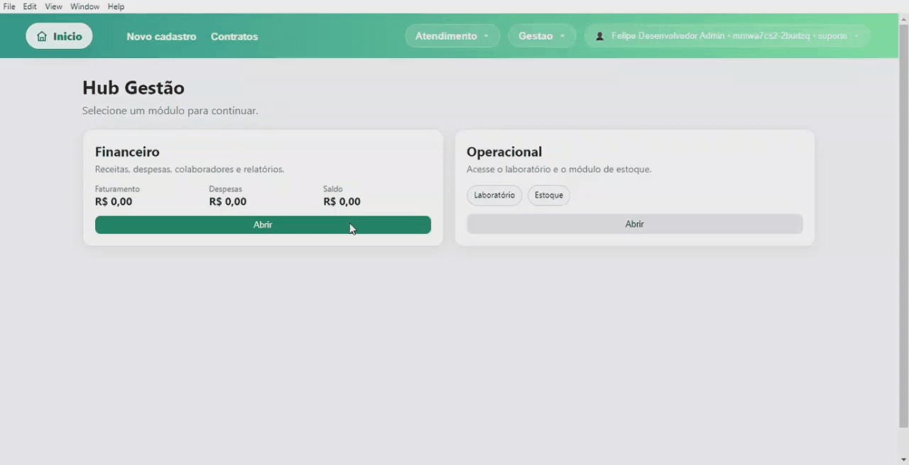
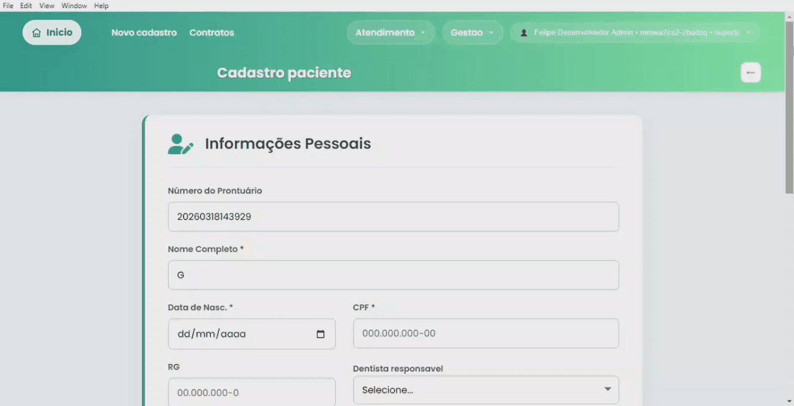
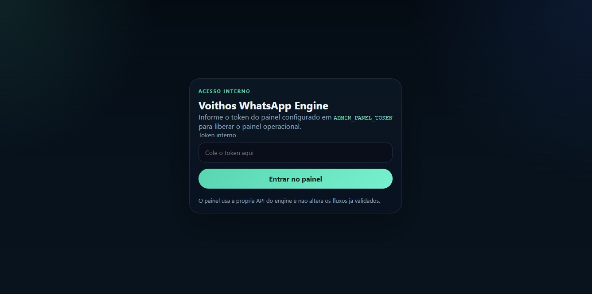
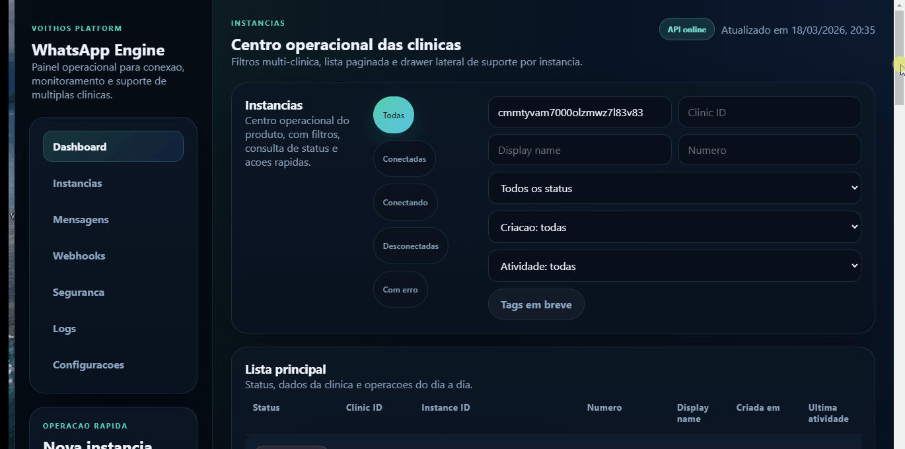

# Voithos

Plataforma desktop em desenvolvimento para gestao de clinicas odontologicas, com foco em agenda operacional, prontuario, atendimento, autenticacao e integracao dedicada com WhatsApp.

## Highlights
- aplicacao desktop com Electron para operacao diaria da clinica
- backend modular para autenticacao, pacientes, agenda e automacoes
- engine isolado de WhatsApp para mensageria e integracoes operacionais
- separacao clara entre interface, IPC, servicos, backend e mensageria
- copia publica sanitizada para demonstrar arquitetura sem expor ambiente real

## Problema
A rotina de uma clinica odontologica costuma ficar fragmentada entre agenda, comunicacao, cadastro de pacientes, prontuario e gestao administrativa. A proposta da Voithos e centralizar esses fluxos em uma unica plataforma operacional, reduzindo friccao no atendimento, melhorando a organizacao da recepcao e aumentando visibilidade sobre a rotina da clinica.

## Screenshots
### Login e controle de acesso
Tela inicial com autenticacao voltada ao uso interno da clinica e entrada controlada no fluxo operacional.


### Dashboard operacional da clinica
Visao inicial consolidada para orientar a operacao diaria e destacar informacoes de contexto rapido.


### Agenda diaria com foco em operacao
Interface pensada para a rotina de recepcao e acompanhamento dos compromissos do dia.


### Gestao de agendamentos
Fluxo dedicado para organizar marcacoes, atualizacoes e acompanhamento da agenda da clinica.


### Prontuario e historico do paciente
Area voltada a concentrar dados clinicos, historico e contexto de atendimento do paciente.


### Painel de gestao
Tela administrativa com foco em acompanhamento operacional e visibilidade gerencial.


### Configuracoes do sistema
Area de parametrizacao para ajustar regras, dados e configuracoes do ambiente da clinica.


### Cadastro de novo paciente
Fluxo de entrada de novos pacientes com foco em organizacao cadastral e continuidade do atendimento.

### WhatsApp NG e login operacional
Entrada dedicada para o painel do engine de mensageria, reforcando a separacao entre a plataforma principal e a camada operacional de comunicacao.


### WhatsApp NG e dashboard de mensageria
Visao do painel do engine responsavel por conexao, monitoramento e operacao da camada de WhatsApp, um dos diferenciais tecnicos da arquitetura.


## O que este projeto demonstra
- modelagem de um produto real para contexto de saude
- organizacao de codigo por responsabilidade e por dominio
- separacao entre shell desktop, interface, backend e integracoes
- preocupacao pratica com autenticacao, segredos e publicacao segura
- estrutura preparada para evolucao de produto e modularizacao progressiva

## Arquitetura
### Visao resumida
```text
Electron UI
  -> preload bridge
    -> IPC handlers
      -> services/shared
        -> backend principal
        -> whatsapp-engine
```

### Estrutura principal
- `main.js`: orquestracao da aplicacao Electron
- `preload.js`: ponte controlada entre renderer e backend local
- `ipc/`: handlers por dominio usados na aplicacao desktop
- `backend/src/`: API, controladores, middlewares, repositorios e servicos
- `services/` e `shared/`: regras de negocio e adaptadores reutilizaveis
- `whatsapp-engine/`: servico isolado de mensageria e integracao
- `prisma/`: modelo de dados do backend principal

## Modulos de maior valor no portfolio
### Agenda e operacao diaria
Fluxos de agenda diaria, agenda mensal e gerenciamento de agendamentos com foco em uso operacional real.

### Pacientes e prontuario
Cadastro, historico, documentos e dados clinicos organizados em torno da jornada do paciente.

### Autenticacao e perfis
Controle de acesso, perfis de usuario e isolamento de responsabilidades administrativas e clinicas.

### Comunicacao e automacao
Camada de comunicacao voltada a confirmacoes, mensagens e integracoes operacionais.

### Financeiro e gestao
Modulos para acompanhamento de rotinas administrativas e indicadores operacionais.

## Decisoes Tecnicas
### Electron como shell da aplicacao
A escolha por Electron atende ao objetivo de entregar uma experiencia desktop unica para operacao interna, com distribuicao simplificada e acesso controlado aos recursos locais da aplicacao.

### Separacao entre UI, IPC e backend
A base evita concentrar toda a regra de negocio na interface. A camada de IPC faz a ponte entre a UI e os servicos, enquanto backend e modulos compartilhados concentram responsabilidades de dominio.

### Motor de mensageria isolado
A integracao de WhatsApp foi separada em um servico proprio para reduzir acoplamento, facilitar evolucao tecnica e manter preocupacoes operacionais fora do fluxo principal da interface.

### Sanitizacao para portfolio publico
A versao publicada foi separada do sistema operacional original. Segredos, logs, sessoes, bancos locais e dados operacionais foram removidos ou substituidos por placeholders para evitar exposicao indevida.

## Highlights de Engenharia
- separacao de responsabilidades entre interface, ponte de integracao, servicos e backend
- organizacao por dominio em vez de concentrar a complexidade nas telas
- integracao externa isolada em um servico proprio para reduzir acoplamento
- preocupacao real com seguranca na publicacao do portfolio
- estrutura que comunica produto, operacao e capacidade de evolucao tecnica

## Stack tecnica
- Electron
- Node.js
- JavaScript e TypeScript
- Express
- Prisma
- SQLite e Postgres em contextos diferentes do projeto
- BullMQ
- Redis
- Pino
- Baileys

## Como ler este projeto como recrutador
Os pontos mais relevantes nesta base sao:
- capacidade de estruturar um produto com varias camadas
- coerencia entre interface, backend e integracoes
- preocupacao com seguranca e publicacao responsavel
- visao de produto aplicada a um sistema operacional real

## Execucao
Esta copia publica foi preparada com foco em avaliacao tecnica. O setup completo depende de variaveis de ambiente e servicos auxiliares definidos em `.env.example`.

Comandos principais presentes no projeto:
- app desktop: `npm start`
- backend principal: `npm run backend:start`
- engine de mensageria: ver scripts em `whatsapp-engine/package.json`

## Roadmap curto
- evoluir demonstracao guiada do produto
- ampliar observabilidade e documentacao tecnica
- consolidar ainda mais a modularizacao por dominio
- preparar demonstracao publica mais proxima do fluxo real
- adicionar GIF curto de navegacao do produto

## Observacao
Este repositorio representa uma versao de portfolio de um sistema em evolucao. Ele foi curado para demonstrar estrutura de produto, decisao tecnica e maturidade de implementacao sem comprometer seguranca operacional.


