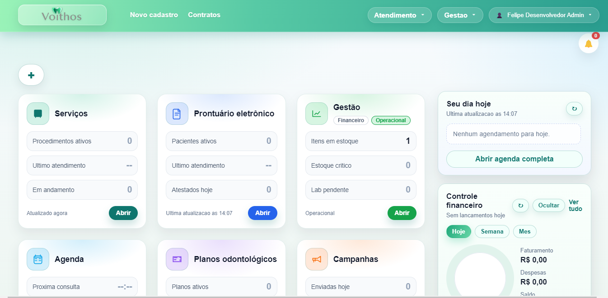
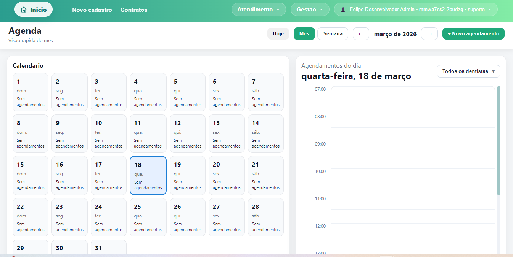
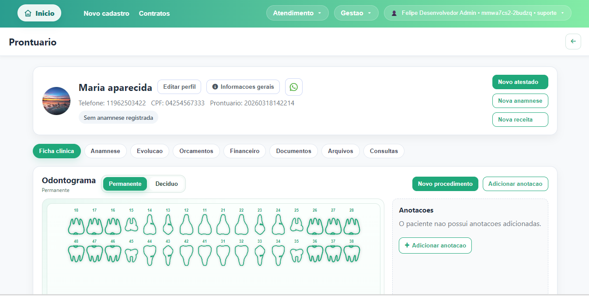
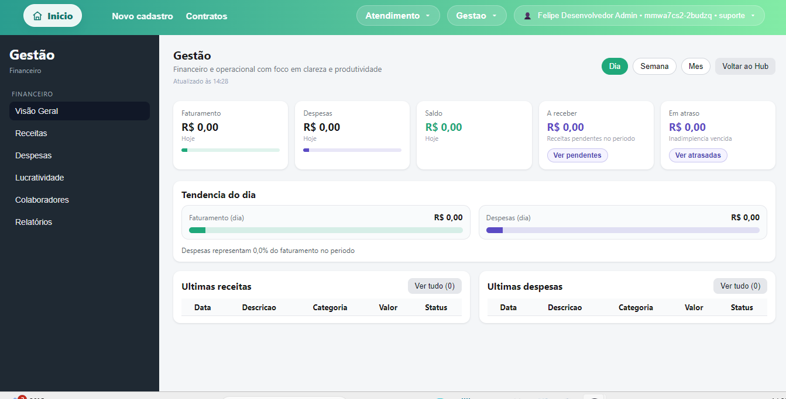
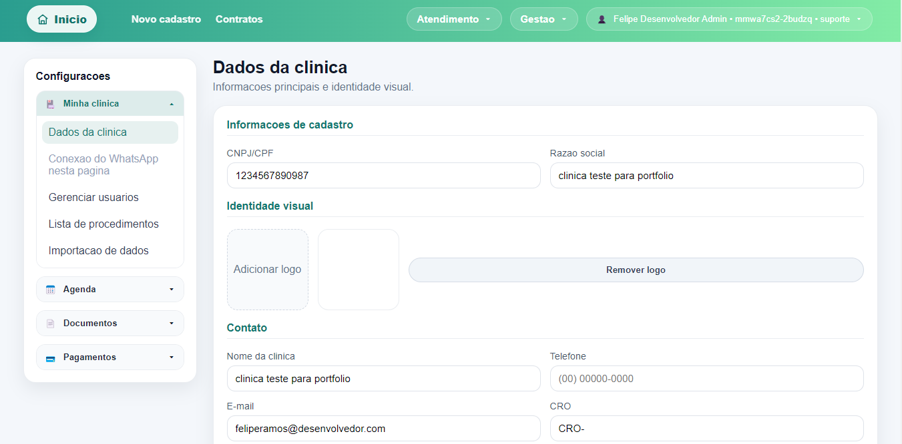
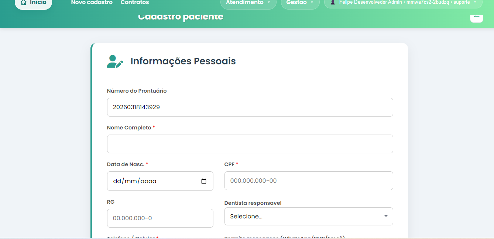

# Screenshots Checklist

Use imagens limpas, sem dados reais, de preferencia em 1600x900 ou 1440x900.

G## Ordem recomendada
1. `01-login.png`

2. `02-dashboard.png`

3. `03-agenda-dia.png`

4. `04-agendamentos.png`

5. `05-prontuario.png`

6. `06-gestao.png`

7. `07-configuracoes.png`

8. `08-cadastro-novo-paciente.png`

## Regras para boas capturas
- use dados ficticios
- evite notificacoes do sistema operacional
- deixe a janela maximizada
- mantenha o zoom padrao
- capture areas completas, nao recortes apertados
- prefira telas com densidade visual e valor de produto

## Legendas sugeridas
- Login e controle de acesso
- Dashboard operacional da clinica
- Agenda diaria com foco na rotina
- Gestao de agendamentos
- Prontuario e historico do paciente
- Painel de gestao
- Configuracoes do sistema
- Cadastro de novo paciente
